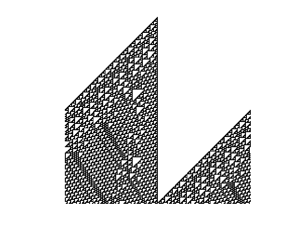

# Elementary-cellular-automaton
Matlab script for displaying result of ECA on an input list


### Example use
Parameters are the rule, a 1D array and the number of rows.

Rule 110 200x200 :
```
a = zeros(1, 200);
a(100) = 1;
ECA(110, a, 200);
```


Rule 126 254x127 :
```
a = zeros(1, 254);
a(127) = 1;
ECA(126, a, 127);
```


Rule 184 500x500 :
```
a = round(rand(1, 500));
ECA(184, a, 500);
```

